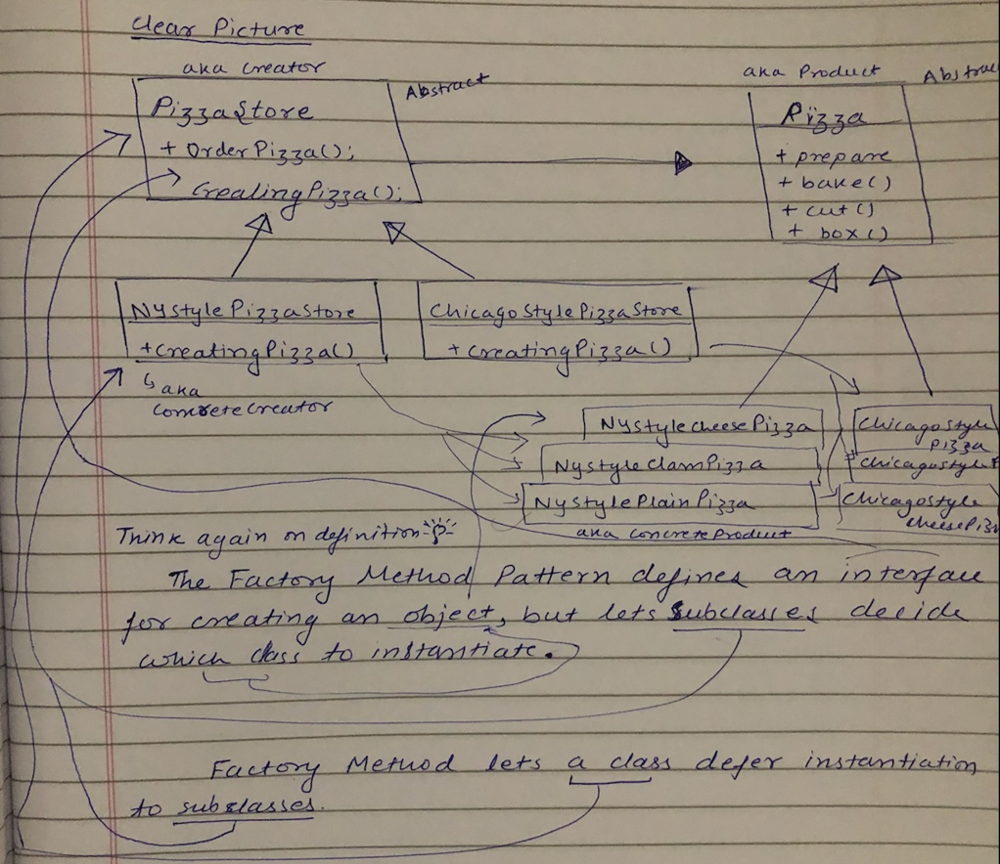

# Design Patterns

## Creational Patterns
### Builder Pattern
Separate the construction of a complex object from its representation so that the same construction process can create different representations

### Factory Method Pattern
The Factory Method Pattern defines an interface for creating an object, but lets subclasses decide which class to instantiate. Factory Method lets a class defer instantiation to subclasses.

